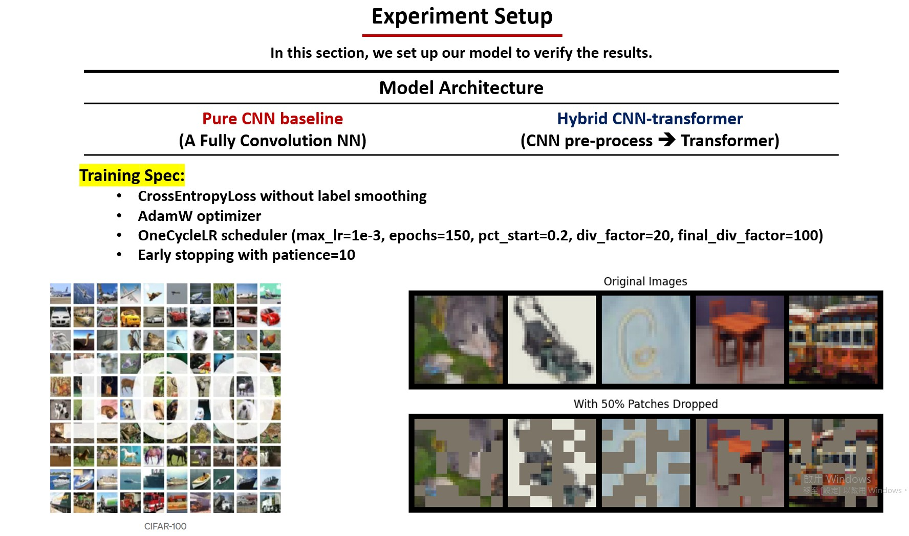
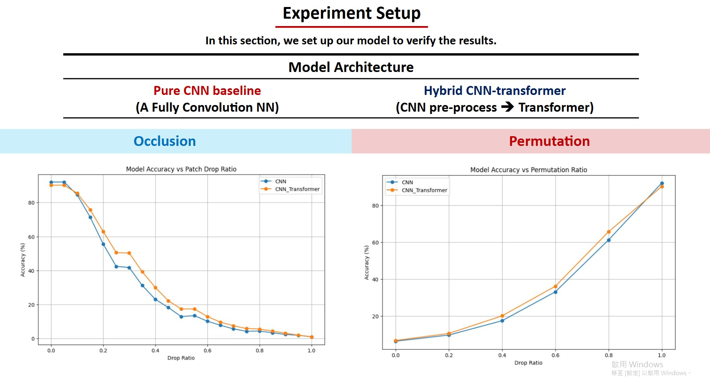

# Vision Models under Image Degradation
***Image Processing 2024 Final Project***

Group 22: Team All Pass

## Overview

Inspired by the paper [Intriguing Properties of Vision Transformer](https://arxiv.org/abs/2105.10497), we aim to investigate the recognition accuracy of CNN models, Transformer models, and CNN+Transformer hybrid models on degraded images (occlusion, permutation). Based on this objective, we conducted a series of implementations.

## File Description

* `Patch-Drop.ipynb` : Implemented a patch-drop function to preprocess the ImageNet-1k dataset and applied it to various image recognition models. By utilizing their pre-trained versions, we observed the tolerance of different model architectures to image occlusion.
* `Permutation.ipynb` : Implemented a image permutation function to preprocess the ImageNet-1k dataset and applied it to various image recognition models. By utilizing their pre-trained versions, we observed the tolerance of different model architectures to image random permutation.
* `CIFAR100CNN.ipynb` : Implemented the HybridCNNTransformer and pureCNN models on the CIFAR-100 dataset to observe whether incorporating transformer blocks can enhance object recognition and improve tolerance to image occlusion and random permutation.
* `HybridCNNTransformer.pth` : The weights of a hybrid CNN-Transformer model.
* `PureCNN.pth` : The weights of a pure CNN model.

## Environment

* Python version: 3.11.10
* Install necessary packages in `requirements.txt`

## Dataset

* [CIFAR-100](https://paperswithcode.com/dataset/cifar-100)
* [Imagenet-1k](https://huggingface.co/datasets/ILSVRC/imagenet-1k)

## Motivation

We propose investigating whether incorporating transformer blocks into CNNs can:
* Enhance robustness to image degradation.
* Maintain CNN's efficient data usage and inductive biases.
* Achieve better performance-computation trade-off.

## Objective

* Evaluate hybrid CNN-transformer models under various degradation scenarios.
* Compare performance against pure CNN and transformer architectures.
* Analyze the impact of transformer integration on model robustness.
* Provide insights for designing more reliable vision systems.

## Patch drop and Permutation

We applied varying levels of patch drop and permutation to the images from Image-1k dataset and tested them on multiple models.

### Occlusion Example

### Permutation Example

### Model Comparison

We found that the model incorporating transformer blocks can better handle images with missing parts.

## Set up our model to verify the results

Based on the analysis results and insights from the paper, we aim to implement a model combining CNN and transformer to validate the results on a small dataset (CIFAR-100).

* The hybrid CNN-Transformer model shows modest improvements in robustness.
* The most significant advantage appears in the 0.2-0.6 drop ratio range.
* Critical performance threshold occurs around 0.2 drop ratio for both models.

Limitation:
* Dataset:
  CIFAR100 images are relatively small (32x32).
* Model:
  The hybrid model is not profoundly integrated.
  No pre-training.

## Conclusion

* With a sufficiently large model and dataset, the attention mechanism effectively helps the model capture correlations within the image.
* Even in constrained scenarios, a transformer-based architecture can enhance model performance.

## Reference
[Intriguing Properties of Vision Transformer](https://arxiv.org/abs/2010.11929) 
[Attention Is All You Need](https://arxiv.org/abs/1706.03762) 
[Vision Transformer](https://arxiv.org/abs/2105.10497) 
[CMT.pytorch](https://github.com/ggjy/CMT.pytorch) 
[ViT-pytorch](https://github.com/jeonsworld/ViT-pytorch)